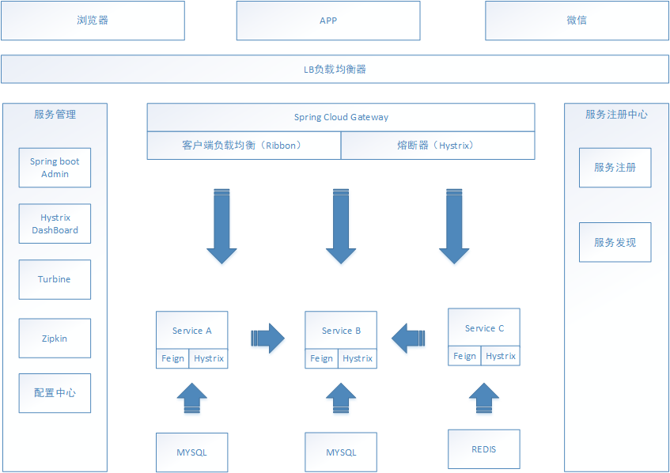
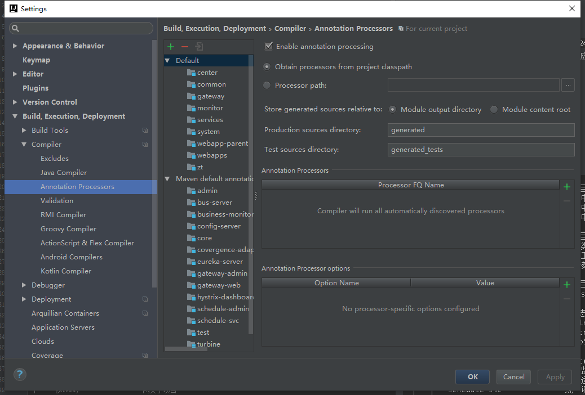

# 中台后端微服务框架

#### 描述
中台新框架采用前后端分离的模式，前端使用iview集成组件，后端采用spring cloud 的微服务框架。
包括注册中心eureka、配置中心（后续应该会切换成apollo）、统一网关（spring gateway）以及监控相关的spring boot admin、熔断监控（hystrix-dashboard）、以及熔断器聚合监控（turbine）。
本框架中管理服务均采用管理端和服务端分离的策略，通过redis等中间件解耦，不存在相互之间的依赖关系。如网关分为网关服务和网关管理，网关管理通过CURD去管理网关的定义并写入到redis，而网关服务则直接从redis中读取配置，即使管理服务宕了也不会受到影响。

#### 软件架构


#### 环境准备
[docker 部署mysql](doc/delivery/docker部署mysql)

[docker 部署rabbitmq](doc/delivery/docker部署rabbitmq)

[docker 部署redis](doc/delivery/docker部署redis)

#### 开发环境

1. 克隆代码库： `git clone http://132.224.44.83:8099/root/zt.git`
2. 生成ide配置： `mvn idea:idea` 并导入对应的ide进行开发,IDE安装lombok插件

注：如果lombok安装后编译报错，请配置File -》 Settings 如下图，勾选Enable annotation processing。


#### 开发指南

###### 开发规范
[开发规范](doc/编码规范.md)

###### 项目目录结构
```
├── center                  --中心子项目
│   ├── bus                     --消息中心
│   ├── config                  --配置中心
│   ├── eureka                  --注册中心 
│   └── pom.xml
├── common                  --通用子项目
│   ├── core                    --核心类库
│   ├── test                    --测试工具类库
│   ├── web                     --WEB核心类库
│   └── pom.xml          
├── gateway                 --网关子项目  
│   ├── gateway-web             --基于springcloud gateway的网关
│   └── pom.xml
├── monitor                 --监控、日志及服务管理子项目
│   ├── admin                   --springcloud admin管理
│   ├── hystrix-dashboard       --hystrix监控
│   ├── turbine                 --turbine监控聚集 
│   └── pom.xml
├── serivices                --serivices子项目
│   ├── business-monitor-svc    --业务监控子服务
│   ├── covergence-adapter-svc  --汇聚适配子服务
│   ├── schedule-svc            --统一调度服务
│   └── pom.xml
├── system                   --系统管理子项目
│   ├── gateway-admin           --springcloud gateway的网关管理模块
│   ├── schedule-admin          --统一调度服务的调度管理模块
├── readme.md                --readme文档入口
└── pom.xml
```
###### module目录结构

```
├── logs                     --日志目录
│   ├── spring.log
│   └── spring.log.2018-04-15.0.gz
├── sql                      --服务sql脚本目录
├── pom.xml                  --module maven配置文件
├── src                      --源码目录
│   ├── main                   --源文件
│   │   ├── java               --java源码目录
│   │   │   ├── dao              --数据操作层
│   │   │   ├── service          --业务逻辑层
│   │   │   ├── provider         --调用第三方服务的提供类
│   │   │   ├── rest             --接口controller
│   │   │   ├── entity           --实体类
│   │   │   │   ├── form           --rest表单校验
│   │   │   │   ├── param          --dao参数，可以由form转化来
│   │   │   │   ├── po             --实体类
│   │   │   │   └── vo             --视图对象
│   │   │   ├── events           --事件或消息处理类
│   │   │   ├── config           --配置类
│   │   │   ├── exception        --异常处理相关类
│   │   │   ├── interceptor      --拦截器相关类
│   │   │   └── task             --定时任务
│   │   └── resources          --配置文件目录 
│   │       ├── application.yml  --springboot的应用配置文件
│   │       └── bootstrap.yml    --springboot的配置文件
│   └── test                   --测试目录
│       ├── java                 --java测试案例目录
│       └── resources          --配置文件目录 
│          └── application.yml   --springboot test的配置文件
└── target                     --编译目标目录
```


